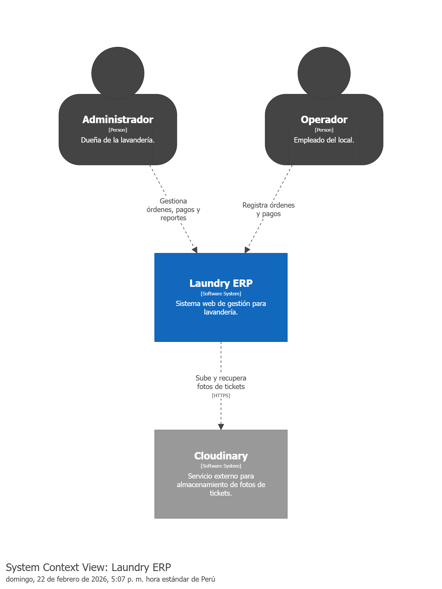
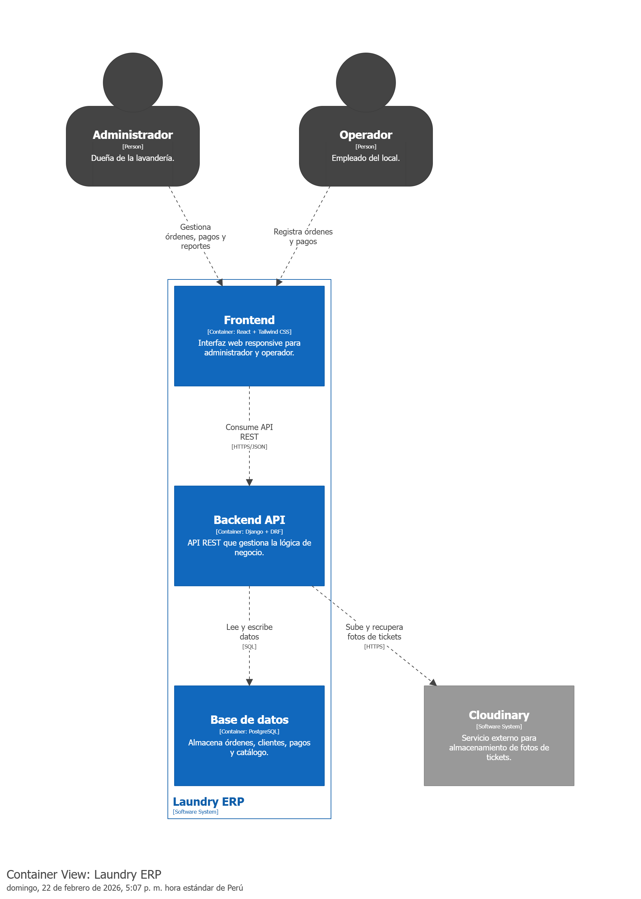

# Laundry Ops — Arquitectura y Diseño

**Vertical SaaS para lavanderías.** Sistema de gestión operativa diseñado para reemplazar el registro manual en papel por una plataforma web responsive, operable desde cualquier dispositivo.

Hoy se construye como sistema **single-tenant** para un cliente real (una lavandería en Lima). La arquitectura cuida no cerrar la puerta a multi-tenant, pero eso no es objetivo del MVP.

---

## 1. Arquitectura del Sistema (Modelo C4)

### Diagrama de Contexto
Muestra a los actores principales y los sistemas externos con los que interactúa la plataforma.


### Diagrama de Contenedores
Zoom a la arquitectura interna: Frontend (SPA), Backend (API REST) y Base de Datos.


---

## 2. Decisiones de Ingeniería y Diseño

El valor de este proyecto radica en las decisiones técnicas orientadas a resolver problemas del negocio. La justificación detallada se encuentra en los siguientes documentos (ADR):

* 📄 **[Stack Tecnológico y Arquitectura (stack.md)](./technical/stack.md)**: Justificación del monolito modular, modelo de timestamps derivados y transacciones atómicas.
* 📄 **[Diseño de Base de Datos (database-design.md)](./technical/database-design.md)**: Reglas de negocio aplicadas al modelo relacional (inmutabilidad financiera, auditoría operativa y separación de contextos).
* 📊 **[Diagrama Entidad-Relación (ERD)](./technical/erd.png)**
* 🎯 **[User Stories (user-stories.md)](./product/user-stories.md)**: Casos de uso priorizados y definidos usando convención Gherkin.

---

## 3. Motivación: por qué existe este proyecto

El cliente real registra sus operaciones en **Winnfact**, un ERP genérico no diseñado para lavanderías. Las consecuencias son directamente visibles en los datos:

- El nombre del cliente se registra en el campo **"Observación"** como texto libre, contra un cliente genérico **"Clientes — Varios"**.
- El saldo pendiente de pago no existe como concepto: se simula con el estado **"PENDIENTE DE PAGO"** y un método de pago llamado **"Crédito"**.

Esto no es un problema de uso incorrecto del software. Es que el software no fue diseñado para esta operación. Laundry Ops existe para resolver ese desajuste.

---

## 4. Descripción del Problema y Solución

**El Problema:** La lavandería opera con tickets en papel autocopiativo, generando:
- Nula visibilidad en tiempo real de las órdenes activas o pendientes de entrega.
- Control de caja opaco (dificultad para rastrear pagos parciales, saldos y Yape/Plin).
- Trazabilidad inexistente para prendas enviadas a terceros (lavado al seco).

**La Solución:** Una plataforma web responsive que permite:
- Registrar órdenes y gestionar pagos parciales con cálculo automático de saldos.
- Controlar el ciclo de vida de una orden mediante timestamps derivados: una orden es **activa** (sin `delivered_at` ni `cancelled_at`), **entregada** (con `delivered_at`) o **cancelada** (con `cancelled_at`).
- Visualizar ingresos diarios y métricas operativas desde un dashboard.

---

## 5. Alcance del Producto

### Dentro del MVP
- Gestión de órdenes (por prenda y por kilo)
- Clientes y su historial
- Pagos y saldos pendientes
- Dashboard operativo y financiero
- Registro de gastos

### Diferido (post-MVP / en evaluación)
- Caja formal
- Notificación por WhatsApp
- Vista "boletas del día"
- Emisión electrónica de boletas
- Multi-tenant _(visión de producto a largo plazo)_

### Descartado
- Contabilidad formal
- Facturas (facturación electrónica SUNAT)
- Multi-local físico

---

## 6. Ecosistema de Repositorios

| Repositorio | Descripción |
|---|---|
| [laundry-ops-api](https://github.com/laundry-erp/laundry-ops-api) | Backend API REST (Django + DRF) |
| [laundry-ops-web](https://github.com/laundry-erp/laundry-ops-web) | Frontend UI (React + Tailwind CSS) |
| **[laundry-ops-architecture](https://github.com/bry4nbe/laundry-ops-architecture)** | **Documentación y diseño (Este repositorio)** |

---

## Estructura de este repositorio

```
laundry-ops-architecture/
├── README.md
├── product/
│   └── user-stories.md
└── technical/
    ├── stack.md
    ├── database-design.md
    ├── erd.png
    ├── c4-context.png
    └── c4-container.png
```

---

## Autor

Desarrollado por **Bryan Barba**.  
Stack: Django · React · PostgreSQL · Tailwind CSS
