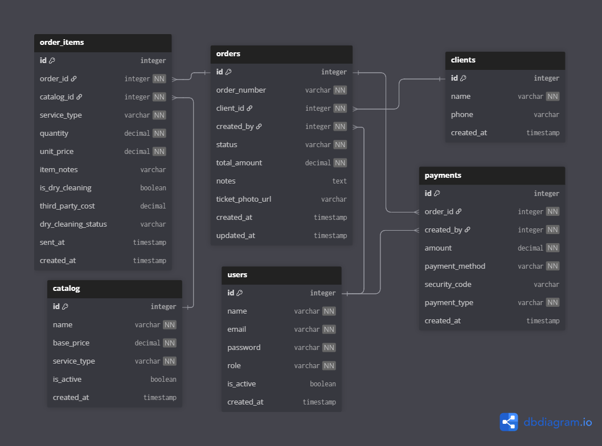

# Diseño de Base de Datos — Laundry Ops

> Este documento justifica las decisiones de diseño del modelo de datos. El ERD completo está disponible en `erd.png`. Aquí se explica el **por qué** detrás de cada decisión no obvia.

---

## Diagrama ERD



---

## Decisiones de Diseño

### 1. DECIMAL en todos los campos monetarios

Todos los campos que representan dinero (`base_price`, `total_amount`, `unit_price`, `amount`, `third_party_cost`) usan `DECIMAL`, no `FLOAT`.

`FLOAT` es una representación binaria de punto flotante que no puede expresar exactamente la mayoría de fracciones decimales. El número `0.10` no existe en punto flotante binario: se almacena como `0.10000000000000000555...`. En una operación aislada la diferencia es invisible, pero en un sistema que acumula pagos parciales, calcula saldos y suma totales de caja diaria, ese error se propaga.

`DECIMAL(10, 2)` en PostgreSQL almacena el número exactamente como se ingresó. `1.50` es `1.50`, sin aproximación. Para un negocio que cierra caja todos los días, la diferencia entre el total calculado por el sistema y el dinero físico en la caja no puede atribuirse a errores de redondeo del software.

---

### 2. Snapshots en `order_items`: `unit_price` y `service_type`

`order_items` almacena `unit_price` y `service_type` aunque esos datos ya existen en `catalog`. Esta redundancia es intencional.

El catálogo de servicios cambia con el tiempo: el precio de lavar una camisa puede subir, un servicio puede desactivarse, el tipo de cobro puede ajustarse. Si `order_items` solo guardara `catalog_id` y leyera el precio mediante JOIN al catálogo, todas las órdenes históricas reflejarían el precio actual, no el precio que tenía el servicio cuando se registró la orden.

Esto rompe dos cosas simultáneamente: la integridad del historial financiero (reportes de ingresos pasados con precios incorrectos) y la confianza del negocio en el sistema (la dueña ve que una orden de hace tres meses muestra un precio distinto al del ticket físico).

El snapshot resuelve esto: al crear el `order_item`, se copia el `unit_price` y el `service_type` del catálogo en ese momento. La orden queda inmune a cambios futuros en el catálogo. Es el mismo principio que usan los sistemas de facturación para líneas de factura.

---

### 3. `dry_cleaning_status` en `order_items`, no en `orders`

Una orden puede contener prendas de lavado normal y prendas de lavado al seco en la misma operación. Si el estado del lavado al seco viviera en `orders`, sería imposible distinguir cuál de las dos prendas fue enviada al tercero y cuál no.

`dry_cleaning_status` vive en `order_items` porque el estado aplica por prenda, no por orden. Solo los items con `is_dry_cleaning = true` tienen este campo activo; para el resto es `NULL`.

Los estados posibles son: `pending_send → sent → returned`. Este diseño se conecta directamente con la máquina de estados documentada en el stack: una `signal post_save` en `OrderItem` evalúa si todos los items de lavado al seco de la orden están en `returned` antes de permitir que la orden transite a `ready`. Sin esta granularidad por item, esa validación sería imposible.

---

### 4. `payment_type` como campo operativo

`payments` incluye `payment_type` con valores posibles `advance`, `partial` y `final`. Este campo no es solo histórico, es operativo.

El dashboard necesita responder en tiempo real: ¿qué órdenes tienen un adelanto pendiente de completar?, ¿cuánto del ingreso de hoy es pago final vs adelanto?. Sin `payment_type`, esas preguntas requieren inferencia sobre los montos, lo que complica las consultas y las hace propensas a errores.

Con `payment_type` la consulta es directa:

```sql
SELECT SUM(amount) FROM payments
WHERE payment_type = 'advance'
AND created_at::date = CURRENT_DATE;
```

La justificación secundaria es análisis de comportamiento futuro: si la mayoría de clientes paga adelanto y luego no vuelve a recoger, eso es un patrón operativo que el negocio necesita detectar. El campo lo habilita sin rediseño.

---

### 5. `order_number` como identificador legible

`orders` tiene tanto `id` (clave primaria técnica) como `order_number` (identificador legible, ej: `ORD-00123`).

`id` es un entero autoincremental que resuelve las relaciones entre tablas de forma eficiente. `order_number` es el identificador que usan las personas: la operadora lo escribe en el ticket físico, la dueña lo menciona por teléfono al cliente, el sistema lo muestra en pantalla.

Mezclar ambos roles en un solo campo crea problemas: si `id` es el identificador visible, el cliente sabe cuántas órdenes tiene el negocio (información sensible). Si `order_number` fuera la PK, las relaciones entre tablas cargan con un varchar en lugar de un integer. La separación resuelve ambos problemas.

---

### 6. `reference_code` en `payments`

`payments` incluye `reference_code` como campo opcional para el número de operación de Yape, Plin o transferencia bancaria.

En el contexto peruano, los pagos digitales son el método predominante en PYMES. Cuando un cliente paga por Yape, el negocio necesita registrar el número de operación para poder verificar el pago ante cualquier disputa. Sin este campo, la verificación depende de capturas de pantalla fuera del sistema, lo que rompe la trazabilidad.

El campo es `nullable` porque efectivo no genera número de operación.

---

### 7. `phone` único y nullable en `clients`

`clients.phone` es `UNIQUE` pero admite `NULL`. Esto resuelve una tensión real del negocio: hay clientes frecuentes con número registrado y clientes ocasionales que no dejan datos.

`UNIQUE` garantiza que no existan dos clientes con el mismo número (evita duplicados por error de ingreso). `nullable` permite registrar una orden para un cliente sin número sin bloquear la operación. PostgreSQL trata múltiples `NULL` como valores distintos en columnas con restricción `UNIQUE`, por lo que varios clientes sin teléfono coexisten sin violar la restricción.

---

### 8. `name` sin restricción UNIQUE en `clients`

`clients.name` no tiene restricción `UNIQUE` deliberadamente. En una lavandería de barrio es completamente posible tener dos clientas llamadas "María García". Forzar unicidad en el nombre bloquearía el registro de la segunda cliente o obligaría a inventar variaciones del nombre que contaminan los datos.

La identificación única del cliente se resuelve por `id` (clave primaria) y opcionalmente por `phone` (único cuando existe). El nombre es un dato de búsqueda y visualización, no de identificación.

---

### 9. Separación de notas logísticas y operativas

Se agregaron campos `notes`(text) tanto en orders como en order_items. Esta aparente redundancia separa dos contextos del negocio:

- `orders.notes`: Información logística o del cliente para el mostrador (ej. "Viene a recogerlo su esposa").

- `order_items.notes`: Informacion operativa para protección del negocio en la zona de lavado (ej. "Camisa ya vino con mancha de vino").

Unificarlos en un solo campo crearía ineficiencia, obligando al operario de lavado a leer notas logísticas, o perdiendo detalles específicos de una prenda en un bloque de texto general.

## Resumen de Decisiones

| Decisión | Alternativa descartada | Razón |
|---|---|---|
| `DECIMAL` en montos | `FLOAT` | Precisión exacta en aritmética monetaria |
| Snapshot `unit_price` en `order_items` | JOIN a `catalog` | Inmunidad a cambios de precio en historial |
| Snapshot `service_type` en `order_items` | JOIN a `catalog` | Consistencia de tipo de cobro en órdenes históricas |
| `dry_cleaning_status` en `order_items` | Campo en `orders` | Estado por prenda, no por orden |
| `payment_type` en `payments` | Inferir por monto | Consultas operativas directas en dashboard |
| `order_number` separado de `id` | Usar `id` como identificador visible | Legibilidad para personas sin exponer volumen del negocio |
| `reference_code` en `payments` | Registro externo al sistema | Trazabilidad de pagos digitales (Yape/Plin) |
| `phone` unique + nullable | Requerir teléfono obligatorio | Clientes ocasionales sin bloquear la operación |
| `name` sin UNIQUE en `clients` | Forzar nombres únicos | Nombres duplicados son un caso de uso real |
| `notes` en `orders` y `order_items` | Campo único en `orders` | Separación de notas logísticas y operativas |

---

*Última actualización: Febrero 2026*
